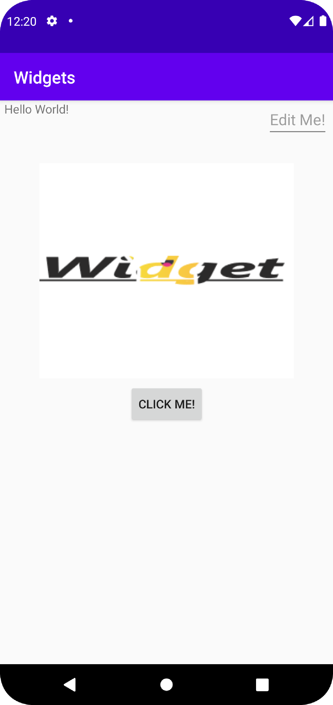

# Rapport

**Skriv din rapport här!**

_Du kan ta bort all text som finns sedan tidigare_.

## Följande grundsyn gäller dugga-svar:

- Ett kortfattat svar är att föredra. Svar som är längre än en sida text (skärmdumpar och programkod exkluderat) är onödigt långt.
- Svaret skall ha minst en snutt programkod.
- Svaret skall inkludera en kort övergripande förklarande text som redogör för vad respektive snutt programkod gör eller som svarar på annan teorifråga.
- Svaret skall ha minst en skärmdump. Skärmdumpar skall illustrera exekvering av relevant programkod. Eventuell text i skärmdumpar måste vara läsbar.
- I de fall detta efterfrågas, dela upp delar av ditt svar i för- och nackdelar. Dina för- respektive nackdelar skall vara i form av punktlistor med kortare stycken (3-4 meningar).

LinearLayout med en vertikal orientation som är lika stor som skärmen.

```
    <LinearLayout
        android:layout_width="match_parent"
        android:layout_height="match_parent"
        android:orientation="vertical"
        app:layout_constraintBottom_toBottomOf="parent"
        app:layout_constraintLeft_toLeftOf="parent"
        app:layout_constraintRight_toRightOf="parent"
        app:layout_constraintTop_toTopOf="parent">
```

ConstraintLayout som är lika stor som skärmen.

```
        <androidx.constraintlayout.widget.ConstraintLayout
            android:layout_width="match_parent"
            android:layout_height="match_parent">
```

TextView som säger "Hello World!" i övre vänstra hörnet med en liten marginal till vänster.

```
            <TextView
                android:layout_width="wrap_content"
                android:layout_height="wrap_content"
                android:text="Hello World!"
                app:layout_constraintLeft_toLeftOf="parent"
                app:layout_constraintTop_toTopOf="parent"
                android:layout_marginLeft="5dp"/>
```

EditText som säger "Edit Me!" i övre högra hörnet med en liten marginal till höger.

```
            <EditText
                android:layout_width="wrap_content"
                android:layout_height="wrap_content"
                app:layout_constraintTop_toTopOf="parent"
                app:layout_constraintRight_toRightOf="parent"
                android:hint="Edit Me!"
                android:layout_marginRight="5dp"/>
```

Button med ID:et "button" som säger "Click Me" i mitten med en stor marginal uppåt.

```
            <Button
                android:id="@+id/button"
                android:layout_width="wrap_content"
                android:layout_height="wrap_content"
                app:layout_constraintTop_toTopOf="parent"
                app:layout_constraintBottom_toBottomOf="parent"
                app:layout_constraintRight_toRightOf="parent"
                app:layout_constraintLeft_toLeftOf="parent"
                android:layout_marginTop="50dp"
                android:text="Click Me!"/>
```

ImageView med bilden "widget" i övre mitten med en stor marginal uppåt och storleken 300 i både höjd samt bredd.

```
            <ImageView
                android:layout_marginTop="50dp"
                android:layout_width="300dp"
                android:layout_height="300dp"
                app:layout_constraintEnd_toEndOf="parent"
                app:layout_constraintStart_toStartOf="parent"
                app:layout_constraintTop_toTopOf="parent"
                app:srcCompat="@drawable/widget" />
```

Privat Button som heter clickMe.

```
    private Button clickMe;
```

Knappen clickMe blir satt till knappen "button" i activity_main.xml och får en OnClickListener som ändrar dess text till "Clicked!" när den är tryckt.

```
        clickMe = findViewById(R.id.button);
        clickMe.setOnClickListener(new View.OnClickListener() {
            @Override
            public void onClick(View view) {
                clickMe.setText("Clicked!");
            }
        });
```
Screenshot av appen.

